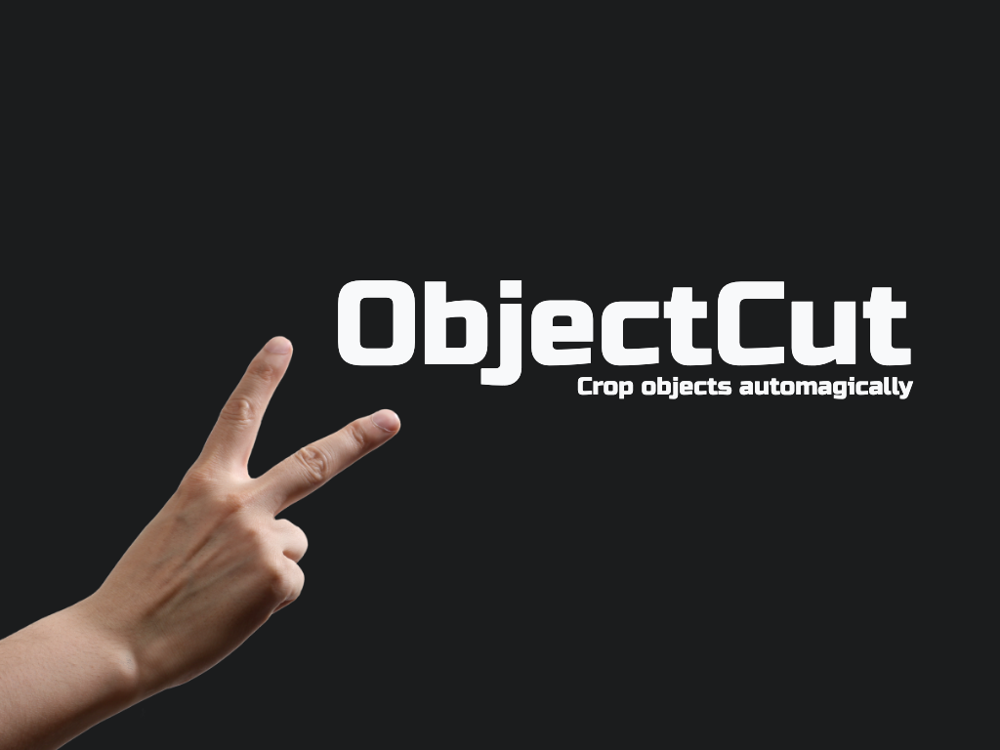
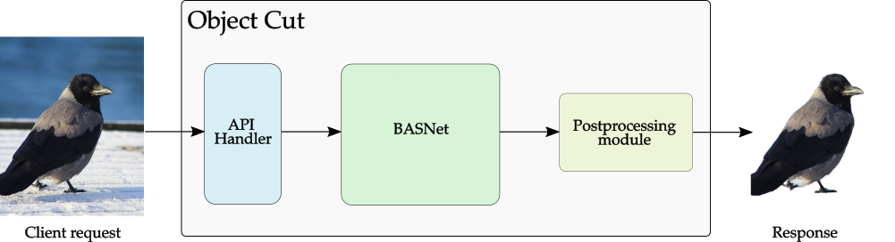

<br>
<p align="center">
  
</p>
<br>

[](http://hits.dwyl.io/AlbertSuarez/object-cut)


[](https://github.com/AlbertSuarez/object-cut)
[](https://GitHub.com/AlbertSuarez/object-cut/stargazers/)
[](https://GitHub.com/AlbertSuarez/object-cut/network/)
[](https://github.com/AlbertSuarez/object-cut)

[Website](https://objectcut.com/) | [RapidAPI](https://rapidapi.com/objectcut.api/api/background-removal)

✂️ _Cut the main object of an image automagically_

This repository contains all the logic necessary to run the ObjectCut API.

## Summary

Object Cut is an online image background removal service that uses [BASNet](https://github.com/NathanUA/BASNet). Removing the background from an image is a common operation in the daily work of professional photographers and image editors. This process is usually a repeatable and manual task that requires a lot of effort and human time. However, thanks to [BASNet](https://github.com/NathanUA/BASNet), one of the most robust and fastest performance deep learning models in image segmentation, Object Cut was able to turn it into an easy and automatic process. 

It was built as an API to make it as easy as possible to integrate. APIs, also known as Application Programming Interfaces, are already a common way to integrate different types of solutions to improve systems without actually knowing what is happening inside. Specifically, RESTful APIs are a standard in the Software Engineering field for designing and specifying APIs. Making it substantially easier to adapt your desired APIs to your workflows.

<br>
<p align="center">
  
</p>
<br>

Object Cut was born to power up the designing and image editing process from the people who work with images daily. Integrating the Object Cut API removes the necessity of understanding the complex inner workings behind it and automates the process of removing the background from images in a matter of seconds.

## Requirements

1. Python 3.7+
2. Docker CE
3. Docker-compose

## Recommendations

Usage of [virtualenv](https://realpython.com/blog/python/python-virtual-environments-a-primer/) is recommended for package library / runtime isolation.

## Usage

To run the server, please execute the following from the root directory:

1. Set up environment creating the `.env` file. This file must have this structure (without the brackets):

    ```
    SECRET_ACCESS={SECRET_ACCESS}
    ```

2. Set up your Google Cloud Storage credentials, decrypt it using GPG with the needed passphrase and decompress it:

    ```bash
    gpg --quiet --batch --yes --decrypt --passphrase="{{ GPG_PASSPHRASE }}" --output ./multiplexer/keys/storage_key.tar ./multiplexer/keys/storage_key.tar.gpg
    tar xvf ./multiplexer/keys/storage_key.tar -C ./multiplexer/keys
    ```

3. Build everything in parallel:

    ````bash
   docker-compose build --parallel 
   ````

4. Deploy the whole stuck (multiplexer, inference and traefik) with just this command.

    ```bash
    docker-compose up -d --scale multiplexer=1 --scale inference=3
    ```

_That's it_! You have ObjectCut running on port 80 routing traffic using _traefik_.

## Run tests

1. Run ObjectCut locally

2. Move to multiplexer module

    ```bash
    cd multiplexer
    ```

3. Run tests

    ```bash
    SECRET_ACCESS={SECRET_ACCESS} python3 -m unittest discover -v
    ```

## Development

### Integrations

This API integrates with several external APIs which are listed below.

#### Google Cloud Storage

For being able to upload the image response to a public bucket for let the users download the output, we are using GCS for doing it once the users specify that in the `output_format=url` (default value) in the API request.

The integration is pretty simple. Every request is being authenticated using the service account JSON file under the `multiplexer/keys` folder where every output image is being upload to the `object-cut-images` bucket under a Life Cycle policy of *3 days* (this has been configured on the Google Cloud Console UI). Once the file has been uploaded (and make it public) the library itself it returns you the public URL that you can return to the user.

### How to add a new test

Create a new python file on the `multiplexer` module called `test_*.py` in `test.api.*` with the following structure:

```python
from test.base import BaseTestClass


class NewTest(BaseTestClass):

    def test_v0(self):
        expected = 5
        result = 2 + 3
        self.assertEqual(expected, result)

```

## Authors

- [Adrià Cabeza](https://github.com/adriacabeza)
- [Albert Suàrez](https://github.com/AlbertSuarez)

## License

Apache-2.0 © ObjectCut
